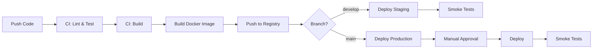

# Deployment Guide

This document describes how to deploy Slop Studios 3 to various environments.

## Table of Contents

- [Overview](#overview)
- [Prerequisites](#prerequisites)
- [Environments](#environments)
- [Deployment Methods](#deployment-methods)
- [CI/CD Pipeline](#cicd-pipeline)
- [Manual Deployment](#manual-deployment)
- [Rollback Procedures](#rollback-procedures)
- [Monitoring](#monitoring)
- [Troubleshooting](#troubleshooting)

## Overview

Slop Studios 3 uses a containerized deployment model with the following
components:

- **Application**: Node.js application running in Docker containers
- **Database**: PostgreSQL for persistent storage
- **Cache**: Redis for session management and caching
- **Load Balancer**: Nginx/ALB for traffic distribution
- **Infrastructure**: AWS resources managed via Terraform

## Prerequisites

### Required Tools

- Docker >= 20.10
- Docker Compose >= 2.0
- AWS CLI >= 2.0 (configured)
- Terraform >= 1.5.0
- Node.js >= 20.0.0
- Git

### Required Access

- AWS account with appropriate IAM permissions
- GitHub repository access
- Container registry access (GHCR)

## Environments

| Environment | Branch    | URL                             | Description            |
| ----------- | --------- | ------------------------------- | ---------------------- |
| Development | `develop` | https://dev.slopstudios.com     | Testing new features   |
| Staging     | `develop` | https://staging.slopstudios.com | Pre-production testing |
| Production  | `main`    | https://slopstudios.com         | Live production        |

### Environment Configuration

Each environment has its own:

- Terraform state file
- Environment variables
- Resource sizing
- Monitoring thresholds

## Deployment Methods

### 1. Automatic Deployment (Recommended)

Deployments are triggered automatically by the CI/CD pipeline:

```
develop branch → Staging (automatic)
main branch → Production (manual approval required)
```

### 2. Manual Deployment

For emergency situations or specific requirements.

## CI/CD Pipeline

### Pipeline Overview



### Pipeline Stages

1. **Lint & Format**: Code quality checks
2. **Type Check**: TypeScript compilation
3. **Unit Tests**: Run unit test suite
4. **Integration Tests**: Run integration tests
5. **Build**: Build application
6. **Docker Build**: Create container image
7. **Push**: Push image to container registry
8. **Deploy**: Deploy to target environment
9. **Smoke Tests**: Verify deployment health

### Triggering Deployments

```bash
# Deploy to staging (automatic on merge to develop)
git checkout develop
git merge feature/my-feature
git push origin develop

# Deploy to production (automatic on merge to main)
git checkout main
git merge develop
git push origin main
# Requires manual approval in GitHub Actions
```

## Manual Deployment

### Using Docker Compose

```bash
# Development
docker-compose up -d

# Production
docker-compose -f docker-compose.yml -f docker-compose.prod.yml up -d
```

### Using Terraform

```bash
# Navigate to environment
cd infrastructure/terraform/environments/prod

# Initialize
terraform init

# Plan changes
terraform plan -out=tfplan

# Apply changes
terraform apply tfplan
```

### Direct Container Deployment

```bash
# Pull latest image
docker pull ghcr.io/slopstudios/slopstudios3:latest

# Stop existing container
docker stop slopstudios3-app

# Start new container
docker run -d \
  --name slopstudios3-app \
  -p 3000:3000 \
  --env-file .env \
  ghcr.io/slopstudios/slopstudios3:latest
```

## Deployment Checklist

### Pre-Deployment

- [ ] All tests passing in CI
- [ ] Code review approved
- [ ] Database migrations prepared (if any)
- [ ] Environment variables updated (if needed)
- [ ] Monitoring alerts configured
- [ ] Rollback plan documented

### During Deployment

- [ ] Monitor deployment logs
- [ ] Watch error rates
- [ ] Check health endpoints
- [ ] Verify database connectivity
- [ ] Test critical user flows

### Post-Deployment

- [ ] Smoke tests passing
- [ ] No increase in error rates
- [ ] Performance metrics normal
- [ ] User feedback monitored
- [ ] Documentation updated

## Rollback Procedures

### Automatic Rollback

The CI/CD pipeline automatically triggers rollback if:

- Health checks fail after deployment
- Error rate exceeds threshold
- Smoke tests fail

### Manual Rollback

#### Option 1: Revert to Previous Image

```bash
# Find previous image tag
docker image ls ghcr.io/slopstudios/slopstudios3

# Deploy previous version
docker pull ghcr.io/slopstudios/slopstudios3:v1.0.0
docker stop slopstudios3-app
docker run -d --name slopstudios3-app -p 3000:3000 ghcr.io/slopstudios/slopstudios3:v1.0.0
```

#### Option 2: Git Revert

```bash
# Revert the last commit
git revert HEAD
git push origin main

# This triggers a new deployment with the reverted code
```

#### Option 3: Terraform Rollback

```bash
# Show Terraform state history
terraform state list

# Rollback to previous state (if using remote state with versioning)
aws s3 cp s3://terraform-state-bucket/prod/terraform.tfstate.backup terraform.tfstate
terraform apply
```

### Database Rollback

If database migrations need to be rolled back:

```bash
# Run rollback migration
npm run db:rollback

# Or specific version
npm run db:migrate:down -- --to 20240101000000
```

## Monitoring

### Health Endpoints

| Endpoint        | Description                          |
| --------------- | ------------------------------------ |
| `/health`       | Basic health check                   |
| `/health/ready` | Readiness probe (dependencies ready) |
| `/health/live`  | Liveness probe (app running)         |

### Key Metrics to Monitor

- **Response Time**: p50, p95, p99 latencies
- **Error Rate**: 4xx and 5xx responses
- **Throughput**: Requests per second
- **CPU/Memory**: Container resource usage
- **Database**: Connection pool, query times
- **Cache**: Hit rate, memory usage

### Alerting

Alerts are configured for:

- Error rate > 1%
- Response time p95 > 500ms
- CPU usage > 80%
- Memory usage > 85%
- Health check failures

## Troubleshooting

### Common Issues

#### Container Won't Start

```bash
# Check logs
docker logs slopstudios3-app

# Check container status
docker ps -a

# Verify environment variables
docker exec slopstudios3-app env
```

#### Database Connection Errors

```bash
# Test database connectivity
docker exec slopstudios3-app npm run db:test-connection

# Check database status
docker exec slopstudios3-db pg_isready -U postgres
```

#### High Error Rate After Deployment

1. Check application logs for errors
2. Verify environment variables are correct
3. Check database migrations ran successfully
4. Verify external service connectivity
5. Consider immediate rollback if critical

### Getting Help

- Check the [CONTRIBUTING.md](../CONTRIBUTING.md) guide
- Review recent deployments in GitHub Actions
- Contact the on-call engineer
- Create an incident in the issue tracker

## Security Considerations

- Never commit secrets to version control
- Use AWS Secrets Manager for sensitive data
- Rotate credentials regularly
- Enable audit logging
- Follow the principle of least privilege

## References

- [Docker Documentation](https://docs.docker.com/)
- [Terraform Documentation](https://www.terraform.io/docs)
- [AWS ECS Documentation](https://docs.aws.amazon.com/ecs/)
- [GitHub Actions Documentation](https://docs.github.com/en/actions)
